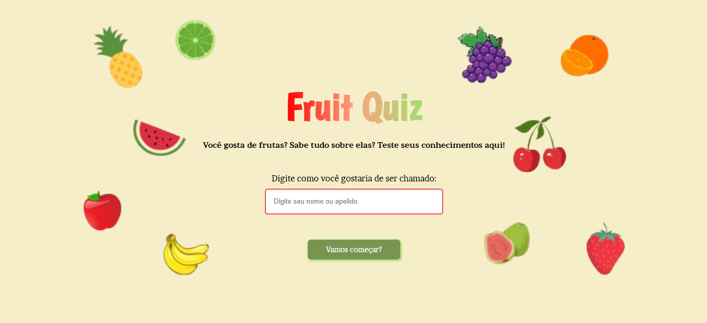

# Fruit Quiz 🍒

**Pronto para um desafio frutífero?** 🍍  
Este é um pequeno quiz interativo com 5 perguntas para testar seus conhecimentos sobre o universo das frutas.  
Acerte todas as perguntas e torne-se o mestre das frutas!

👉 Acesse o projeto aqui:  
🔗 https://fruit-quiz-six.vercel.app/

---

## 📌 Sobre o Projeto
O **Fruit Quiz** foi inicialmente desenvolvido em **fevereiro de 2025**, com o objetivo de praticar **HTML, CSS e JavaScript**, focando principalmente na lógica, manipulação do DOM e controle de fluxo entre páginas.

Em **janeiro de 2026**, o projeto passou por uma **refatoração completa de layout e estrutura**, onde:
- o código foi revisitado com uma nova visão mais madura
- o HTML foi reorganizado com tags semânticas
- o CSS foi reestruturado para melhorar o layout e a experiência do usuário
- o design visual foi aprimorado, mantendo toda a lógica original funcionando

Essa atualização reflete minha evolução como desenvolvedora, mostrando a capacidade de **analisar projetos antigos, refatorar código e melhorar a experiência do usuário sem alterar a funcionalidade**.

---

## 🛠️ Tecnologias Utilizadas

Este projeto foi desenvolvido utilizando tecnologias web front-end:

- **HTML5** – Estruturação semântica das páginas do quiz  
- **CSS3** – Estilização, layout, animações visuais e responsividade  
- **JavaScript** – Lógica do quiz, validação das respostas, feedback visual e navegação entre perguntas  

---

## ✨ Funcionalidades

- **Quiz Interativo** com perguntas de múltipla escolha  
- **Feedback Visual** para respostas corretas e incorretas  
- **Progressão Automática** para a próxima pergunta após acerto  
- **Experiência Responsiva** para desktop e dispositivos móveis  
- **Interface Refatorada**, mantendo a lógica original do projeto

---
### 📬 Contato
* [Github](https://github.com/thamiresantos)
* [Instagram](https://www.instagram.com/codewiththa/)
* [Linkedin](https://www.linkedin.com/in/thamires-santos-a9a652263) 

---
### © 2025 - Este projeto foi desenvolvido por Thamires Santos. 
